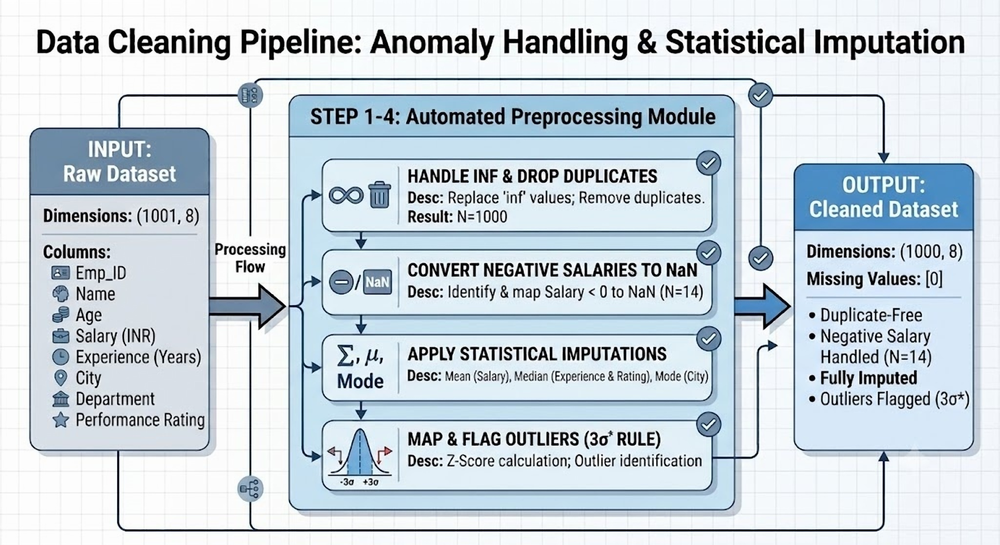
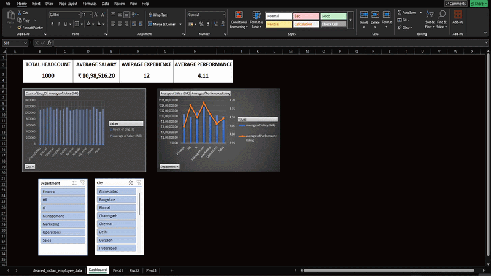
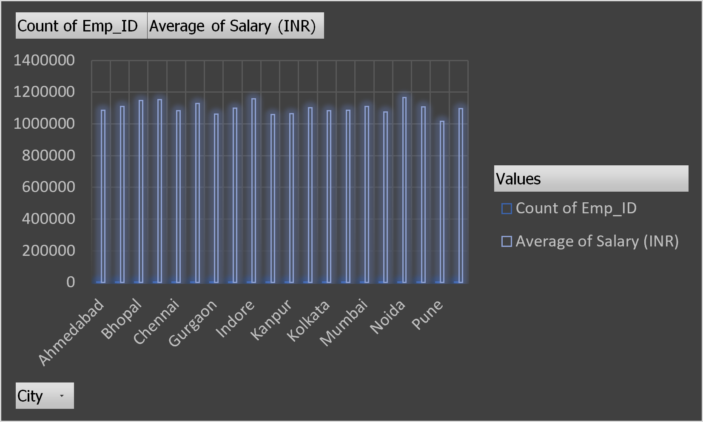
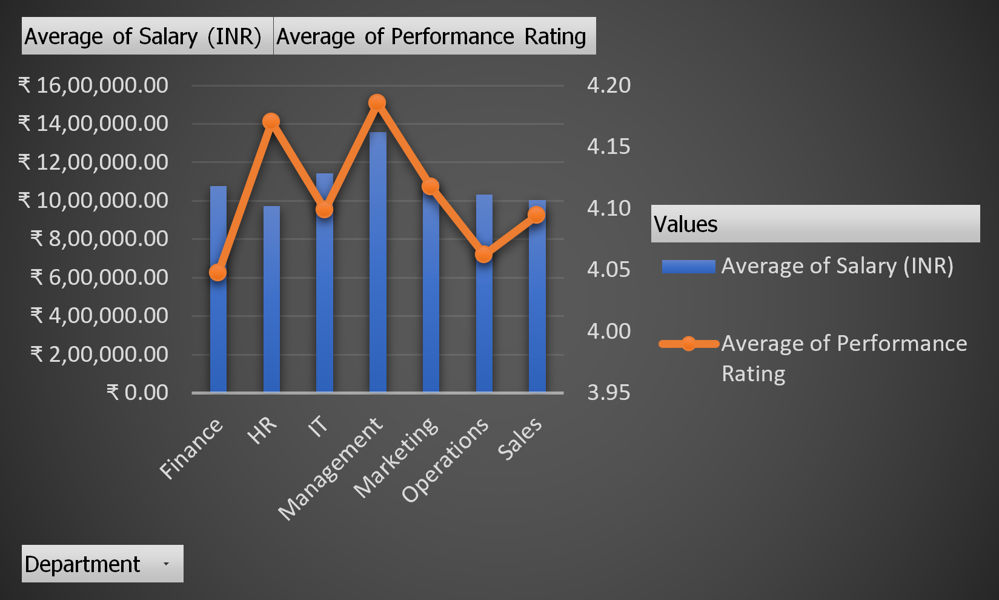
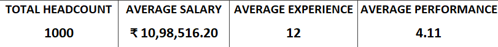

# Indian Employee Data Cleaning & Preprocessing Pipeline

## Project Overview
This project focuses on building a robust data cleaning and preprocessing pipeline for an Indian Employee Dataset (`indian_employee_data.csv`). Raw datasets often contain missing entries, duplicate rows, incorrect formatting, and anomalies such as impossible negative numbers. This pipeline automates the data sanitization process using `pandas` and `numpy`, transforming raw data into an analytical-ready asset.

### Tech Stack & Environment
* **Python Version**: 3.11.15
* **Key Libraries**:
    * **Pandas**: 3.0.3 (Data Manipulation and cleaning)
    * **Numpy**: 2.4.6 (Numerical operations and handling NaNs)
* **Environment**: Anaconda Distribution
* **Analytics**: Microsoft Excel (Pivot Tables, Dashboard & Slicers)

### Dataset Characteristics
#### Initial Dimensions
* **Rows:** 1001
* **Columns:** 8 (`Emp_ID`,`Name`,`Age`,`Salary (INR)`,`Experience (Years)`,`City`,`Department`, `Performance Rating`)

#### Identified Anomalies (Pre-Cleaning)
* **Duplicate Rows**: 1 duplicated record detected
* **Logical Irregularities**: 14 records contained impossible negative salary entries.
* **Missing Values**:
    * `Salary (INR)`: 40 missing values.
    * `Experience (Years)`: 40 missing values.
    * `City`: 40 missing values.
    * `Performance Rating`: 40 missing values.

### Data Cleaning Architecture
The pipeline implements Strategic Missing Value Imputation and statistical outlier detection rather than blindly dropping incomplete rows.

#### 1. De-duplication & Initial Formatting
* Standardizes initial values (`inf`) to `NaN`.
* Identifies and drops identical duplicate rows to preserve data integrity.

#### 2. Negative Value Correction
* Scans the `Salary (INR)` column for invalid negative numbers and forces them to NaN before applying mathematical imputations.

#### 3. Feature-Specific Imputation Rules
* **Salary (INR)**: Filled using the *Arithmetic Mean* of the column to preserve the average scale.
* **Experience (Years)**: Filled using the *Median* value to shield from skewing caused by high-tenure/senior employees.
* **Performance Rating**: Safely coerced into a numeric type (converting faulty strings to NaN) and then filled using its *Median*.
* **City**: Filled via the Mode (the mot frequent occuring city in the dataset).

#### 4. Outlier Detection ($3\sigma$ Rule)
The Pipeline maps outlier boundaries using the empirical standard deviation rule ($\pm 3$ standard deviations from the mean):

$$\text{Lower Bound} = \mu - 3\sigma$$

$$\text{Upper Bound} = \mu + 3\sigma$$

* Calculated Mean ($\mu$): 1,098,516.20 INR
* Calculated Std Dev ($\sigma$): 282,382.04 INR
* Valid Statistical Salary Range: [251,370.07 to 1,945,662.33] INR
* Outliers Flagged: 1 extreme record detected.




## How to Run the Project

### Environment Setup & Installation

```bash
# 1. Open your terminal or Anaconda Propmt and create the environment
conda create --name project_env python=3.11 -y

# 2. Activate your new environment
conda activate project_env

# 3. Install the pipeline packages
conda install pandas
conda install numpy
```

### Directory Structure
```plaintext
├── Data/
│   ├── cleaned_indian_employee_data.csv    # Final output dataset
│   └── indian_employee_data.csv            # Raw data input
├── images/
│   ├── Pivot1_Analysis.png                 # Department performance snapshot
│   ├── Pivot2_Analysis.png                 # Salary vs. experience correlation
│   └── Pivot3_Analysis.png                 # Regional headcount metrics
│   └── Pipeline_design.jpg                 # Pipeline architecture diagram
├── media/
│   └── Presentation.gif                    # Dashboard walkthrough animation
├── .gitignore                              # Git untracked files configuration
├── data_cleaning.ipynb                     # Main data cleaning pipeline 
└── README.md                               # Project documentation
```

### Execution
Run the main cleaning notebook to clean the data and automatically export the sanitized dataset.

The notebook will clean the dataset and save it directly to the data folder with zero missing values remaining.


## Pipeline Validation Results

After executing the pipeline, a final programmatic check validates that the dataset is completely clean and structured for downstream analysis:

* **Final Dimensions:** 1,000 rows, 8 columns (1 duplicate successfully removed).
* **Data Integrity:** 0 missing entries remain across all features.
* **Mathematical Corrections:** All 14 invalid negative salary markers were successfully contextualized and resolved using statistical mean imputation.

### Data Health Matrix (Post-Cleaning)

| Feature Column | Pre-Cleaned NaNs | Post-Cleaned NaNs | Imputation Strategy |
| :--- | :---: | :---: | :--- |
| `Emp_ID` | 0 | 0 | None (Primary Key) |
| `Name` | 0 | 0 | None |
| `Age` | 0 | 0 | None |
| `Salary (INR)` | 40 | 0 | Arithmetic Mean ($\mu$) |
| `Experience (Years)` | 40 | 0 | Median |
| `City` | 40 | 0 | Mode (Most Frequent) |
| `Department` | 0 | 0 | None |
| `Performance Rating`| 40 | 0 | Type Coercion $\rightarrow$ Median |

---

## 📊 Interactive Analytics & Dashboard
To transform the structured, clean dataset into actionable business intelligence, an interactive executive dashboard was constructed in Microsoft Excel. This interface serves as a visual layer to track institutional performance, salary distributions, and organizational demographics.

### 🔁 Live Dashboard Demonstration
The dashboard features integrated slicers for dynamic filtering across departments and cities, allowing stakeholders to view granular subsets of data in real-time.




### 🔍 Deep-Dive Pivot Analysis
The business intelligence layer is supported by 3 core pivot matrices engineered to isolate key operational dynamics:
#### 1. Performance Distribution & Headcount by Department
Tracks how performance scores are distributed across various corporate functions to identify high-achieving teams and operational bottlenecks.



#### 2. Salary vs. Experience Correlation Matrix
Cross-references career longevity (Experience in Years) against compensation bands (Salary INR) to audit payroll equity and structure clear promotion tiers.



#### 3. Geographic & Regional Headcount Metrics
A macro-level regional assessment mapping talent density and average department footprints across India's primary commercial hubs.


---

## 📈 Analytical Insights & Impact

By applying statistical imputation over row deletion, the pipeline preserved **40 records** that would have otherwise been dropped due to missing data. 

1. **Skew Protection:** Utilizing the **Median** for `Experience (Years)` effectively protected the metric from being artificially inflated by senior employees with extreme tenure.
2. **Operational Baseline:** Setting the standard statistical outlier thresholds using the $3\sigma$ rule successfully flags hyper-inflated anomalies without stripping valid high-earner data points.

